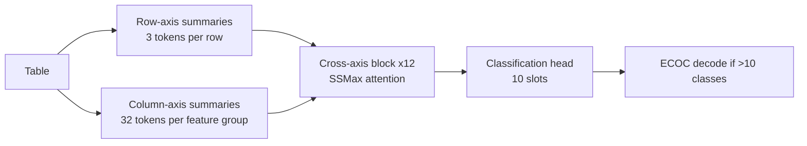

# EXAONE Tabular (LG AI Research)

*New in TabTune 0.2.0.*

**EXAONE Tabular** is an in-context learner from LG AI Research built on the **Cross-axis
Summary Transformer (CAST)**. In TabTune it is registered as `EXAONETabular`, with `EXAONE`
as a short alias.

```python
from tabtune import TabularPipeline

pipeline = TabularPipeline(
    model_name="EXAONE",
    task_type="classification",
    tuning_strategy="inference",
    model_params={"n_ensemble": 8},
)
pipeline.fit(X_train, y_train)
print(pipeline.evaluate(X_test, y_test))
```

!!! note "Name resolution"
    `normalise_name()` strips `-`, `_`, `.` and whitespace, so `"exaone-tabular"`,
    `"EXAONE_Tabular"` and `"exaone tabular"` all resolve to `EXAONETabular`.

---

## 1. Architecture

CAST exchanges information across **both axes** of the table:

- **3 summary tokens per row** pool that row's columns
- **32 summary tokens per feature group** pool that column across rows
- The two axes alternate for **12 blocks** under SSMax-normalised attention



At **~21M parameters** it is the smallest bundled foundation model, which is why the
released default is an **8-member ensemble**.

| Property | Value |
|---|---|
| Family | Cross-axis ICL |
| Parameters | ~21M |
| Default ensemble | 8 members |
| Weights | `LG-AI-Research/EXAONE-Tabular` |
| Native NaN handling | Yes |
| Source | <https://github.com/LGAI-Research/EXAONE-Tabular> |

TabTune vendors the complete inference runtime, including the ECOC decomposition, the
attention-based feature selector and the CUDA execution planner.

---

## 2. Three limits, and not one of them is an error

| Limit | Value | What happens when you exceed it |
|---|---:|---|
| Support rows | `100,000` | Random subsample down to the limit |
| Features | `100` | Attention-based selection of the top 100 columns |
| Classes | `10` | **ECOC decomposition** — one full ensemble forward per codebook row |

All three ceilings are **soft**, and none of them raises.

!!! warning "`max_classes` is deliberately `None` in the registry"
    `max_classes` is a *hard* constraint that raises even under `envelope_mode='warn'`.
    Declaring EXAONE's 10-slot head capacity would reject datasets this model handles by
    design via ECOC — so the registry leaves it unset.

```python
from tabtune.registry import check_envelope, get_model_spec

for v in check_envelope("EXAONE", n_rows=250_000, n_features=120, n_classes=14):
    print(f"[{v.severity}] {v.message}")
# rows and features warn; 14 classes is fine

get_model_spec("EXAONE").envelope.max_classes   # None
```

These values mirror `SUPPORT_ROW_LIMIT` / `FEATURE_LIMIT` / `CLASS_CAPACITY` in
`tabtune/models/exaone/backbone.py`.

!!! tip "ECOC costs real time"
    Above ten classes each prediction runs one full 8-member ensemble forward **per codebook
    row**. Budget accordingly, or reduce `n_ensemble`.

---

## 3. Model parameters

```python
model_params = {
    'n_ensemble': 8,           # ensemble members; default from the released manifest
    'device': 'cuda',          # None -> auto-detect
    'dtype': None,             # None defers to the checkpoint manifest
    'checkpoint_path': None,   # local weights file (required for regression)
    'max_vram_bytes': None,    # cap for the CUDA execution planner
    'random_state': 42,
}
```

| Parameter | Type | Default | Description |
|---|---|---|---|
| `n_ensemble` | int | 8 | Ensemble members. Lower it to cut latency, especially with ECOC. |
| `device` | str | auto | `'cuda'` or `'cpu'` |
| `dtype` | torch dtype | manifest | Override the checkpoint's declared dtype |
| `checkpoint_path` | str | `None` | Local `.safetensors` file |
| `max_vram_bytes` | int | `None` | Budget hint for the execution planner |
| `random_state` | int | 42 | Seed |

---

## 4. Supported strategies

| Task | Strategy | Modes |
|---|---|---|
| Classification | `inference` | — |
| Classification | `finetune` | `meta-learning` (default), `sft`, `turn_by_turn` |
| Classification | `peft` | see the caveat below |
| Regression | `inference`, `finetune` | `turn_by_turn` — **experimental** |

### 4.1 Fine-tuning

```python
pipeline = TabularPipeline(
    model_name="EXAONE",
    task_type="classification",
    tuning_strategy="finetune",
    finetune_mode="meta-learning",
    tuning_params={"epochs": 2, "learning_rate": 1e-5},
)
pipeline.fit(X_train, y_train)
```

### 4.2 PEFT does not mean LoRA here

!!! danger "`peft` on EXAONE runs as a full fine-tune"
    EXAONE applies its projections as raw `nn.Parameter` tensors through `F.linear` rather
    than `nn.Linear` submodules. The LoRA injector finds nothing to wrap, logs a warning,
    and the run proceeds as a **full fine-tune**. Do not attribute a memory saving to LoRA
    here.

---

## 5. Regression needs a local checkpoint

Only the **classification** checkpoint is published. The regression code path is complete
and tested, but nothing downloads:

```python
pipeline = TabularPipeline(
    model_name="EXAONE",
    task_type="regression",
    model_params={"checkpoint_path": "/path/to/exaone-tabular-regressor.safetensors"},
)
```

Or set the environment variable:

```bash
export EXAONETABULAR_REGRESSOR_WEIGHTS=/path/to/weights.safetensors
export EXAONETABULAR_CLASSIFIER_WEIGHTS=/path/to/classifier.safetensors   # optional override
```

Without either, the wrapper raises `FileNotFoundError`. This is why `regression` is marked
**experimental** on the spec — it is a weights problem, not a code problem.

---

## 6. Licensing

!!! danger "Code and weights are licensed separately"
    - **Code**: BSD-3-Clause-LG AI Research — permits commercial use.
    - **Weights**: EXAONE AI Model License Agreement 1.1 - NC — granted *"solely for
      research purposes"*; the agreement expressly prohibits using the model, derivatives or
      output for any commercial purpose.

    `LicenseSpec` describes the **weights**, so `commercial_use_ok=False` and
    `license_mode='commercial'` blocks.

A fine-tuned checkpoint is a **Derivative** under that agreement: still research-only, and
its name must begin with `EXAONE`.

```python
from tabtune.registry import check_license
check_license("EXAONE", "commercial")     # raises LicenseError
```

Commercial alternatives suggested by the registry: Mitra, TabICLv2, OrionMSP, OrionMSPv1.5,
OrionBix.

---

## 7. When to use EXAONE

**Good fit**

- Small-to-medium tables where a 21M-parameter model's latency is attractive
- Wide tables — the attention-based selector handles >100 features gracefully
- Many-class problems that other checkpoints reject outright (ECOC handles them)
- Research and internal evaluation

**Poor fit**

- Anything commercial (licence)
- Regression without a locally supplied checkpoint
- Latency-critical many-class inference (ECOC multiplies forward passes)

---

## See Also

- [Model Overview](overview.md)
- [Model Registry](../user-guide/registry.md)
- Runnable example: `examples/17_exaone_tabular.py`
