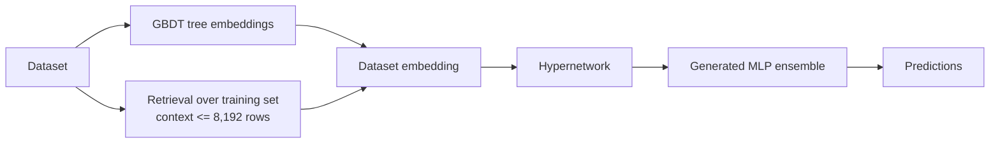

# iLTM: Integrated Large Tabular Model

*New in TabTune 0.2.0.*

**iLTM** takes a different route to tabular transfer: instead of running in-context
attention over your rows, a **hypernetwork** *generates* an ensemble of MLPs conditioned on
an embedding of your dataset. It combines GBDT tree embeddings with retrieval over the
training set.

Registered as `ILTM`; `iLTM`, `i-LTM` and `IntegratedLargeTabularModel` all resolve to it.

```python
from tabtune import TabularPipeline

pipeline = TabularPipeline(
    model_name="iLTM",
    task_type="classification",
    tuning_strategy="inference",
)
pipeline.fit(X_train, y_train)
print(pipeline.evaluate(X_test, y_test))
```

---

## 1. Architecture



| Property | Value |
|---|---|
| Family | Hypernetwork |
| Weights | `dbonet/iLTM` (ungated on Hugging Face) |
| Native categorical handling | Yes |
| Retrieval context | capped at 8,192 rows |
| Licence | Apache-2.0 (code **and** weights) |
| Paper | <https://arxiv.org/abs/2511.15941> |
| Source | <https://github.com/AI-sandbox/iLTM> |

TabTune vendors a modified copy; the licence text and change notices are retained under
Apache-2.0 sections 4(b) and 4(c).

---

## 2. Envelope

| Constraint | Value | Severity |
|---|---:|---|
| `max_classes` | `100` | **error** |
| Features | dimensionality-agnostic (evaluated from 4 to ~20,000) | — |
| Retrieval context | 8,192 rows | internal cap |

!!! warning "The 100-class limit is architectural, and TabTune enforces it"
    The hypernetwork's first linear layer is sized from `n_classes_limit`, so the released
    checkpoints are frozen at 100 classes. **Upstream does not guard it** — a 101-class
    target fails inside `F.one_hot` with a bare torch error deep in the forward pass, after
    the checkpoint has already downloaded. TabTune checks it in the registry instead.

```python
from tabtune.registry import check_envelope
check_envelope("iLTM", n_rows=5_000, n_features=50, n_classes=101)
# EnvelopeError: iLTM supports at most 100 classes (found 101)
```

!!! note "Pretrained on classification only"
    Regression is reached by transfer plus light fine-tuning rather than a pretrained
    regression head. Expect to fine-tune for competitive regression numbers.

---

## 3. Model parameters

```python
model_params = {
    'checkpoint': 'xgbrconcat',   # released checkpoint variant
    'checkpoint_dir': None,       # local directory of weights
    'n_ensemble': None,           # generated MLPs; None -> checkpoint default
    'device': 'cuda',
    'random_state': 42,
}
```

| Parameter | Type | Default | Description |
|---|---|---|---|
| `checkpoint` | str | `'xgbrconcat'` | Which released checkpoint to load |
| `checkpoint_dir` | str | `None` | Load from a local directory instead of the Hub |
| `n_ensemble` | int | checkpoint default | Number of generated MLPs; more = slower, steadier |
| `device` | str | auto | `'cuda'` or `'cpu'` |
| `random_state` | int | `42` | Seed |

Unknown keys are filtered against the vendored engine's signature and logged at debug level
rather than silently forwarded.

---

## 4. Supported strategies

| Task | Strategy | Modes |
|---|---|---|
| Classification | `inference` | — |
| Classification | `finetune` | `meta-learning` (default), `sft`, `turn_by_turn` |
| Classification | `peft` | LoRA over the generated MLPs |
| Regression | `inference`, `finetune` | `turn_by_turn` (default) |

```python
pipeline = TabularPipeline(
    model_name="iLTM",
    task_type="classification",
    tuning_strategy="finetune",
    tuning_params={
        "epochs": 5,
        "learning_rate": 1e-5,
        "finetune_mode": "meta-learning",
    },
)
```

---

## 5. Licensing

Apache-2.0 for both code and weights, and the Hugging Face repository is **ungated** — no
token, no access request. Attribution is required.

```python
from tabtune.registry import get_model_spec
get_model_spec("iLTM").license.badge   # 'yes (attribution)'
```

This makes iLTM one of the few bundled models you can ship commercially without caveats,
alongside TabICL / TabICLv2 (BSD-3), the Orion family (MIT), Mitra (CC-BY, attribution) and
xRFM (MIT).

---

## 6. When to use iLTM

**Good fit**

- **Commercial deployment** — Apache-2.0 weights, ungated download
- Wide tables — dimensionality-agnostic by construction
- Many-class classification up to 100 classes
- Ensembling: a hypernetwork's errors differ from an ICL model's

**Poor fit**

- More than 100 classes (hard limit)
- Regression without fine-tuning budget
- Very large retrieval contexts — the context is capped at 8,192 rows

---

## See Also

- [xRFM](xrfm.md) — the other non-transformer model added in 0.2.0
- [Model Overview](overview.md)
- [Model Registry](../user-guide/registry.md)
