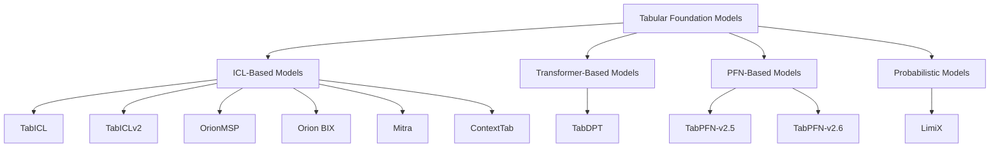

# Supported Models Overview

TabTune integrates state-of-the-art tabular foundation models, each with unique architectural properties, strengths, and use cases. This document provides a comprehensive overview of all supported models.

---

## 1. Model Ecosystem

---

## 2. Model Comparison Matrix

| Model | Paradigm | Architecture | Best For | Scaling | Speed | Memory | PEFT |
|-------|----------|--------------|----------|---------|-------|--------|------|
| **TabPFN** | PFN/ICL | Approximate Bayesian | Small datasets | <10K | ⭐⭐⭐⭐⭐ | ⭐⭐ | ⚠️ |
| **TabICL** | Scalable ICL | Column-Row Attention | Balanced | 10K-1M | ⭐⭐⭐⭐ | ⭐⭐⭐ | ✅ |
| **OrionMSP** | Scalable ICL | Multi‑scale priors | Generalization | 50K-2M+ | ⭐⭐⭐ | ⭐⭐⭐ | ✅ |
| **Orion BIX** | Scalable ICL | Biaxial interactions | Accuracy | 50K-2M+ | ⭐⭐ | ⭐⭐⭐⭐ | ✅ |
| **TabDPT** | Denoising | Transformer | Large Datasets | 100K-5M | ⭐⭐⭐ | ⭐⭐⭐⭐ | ✅ |
| **Mitra** | 2D Attention | Cross‑Attention | Complex Patterns | 10K-500K | ⭐⭐ | ⭐⭐⭐⭐⭐ | ✅ |
| **ContextTab** | Semantic ICL | Text + Embeddings | Text-Heavy | 10K-500K | ⭐⭐ | ⭐⭐⭐ | ⚠️ |
| **TabPFN-v2.6** | PFN/ICL | Approximate Bayesian + Native FT | Small datasets | <10K | ⭐⭐⭐⭐⭐ | ⭐⭐ | ⚠️ |
| **TabICLv2** | Scalable ICL | Improved Column-Row Attention | Balanced + Regression | 10K-1M | ⭐⭐⭐⭐ | ⭐⭐⭐ | ❌ |

---

## 3. Selection Quick Tips

- <10K rows: TabPFN (inference) or TabICL (base‑ft)
- 50K–2M rows: OrionMSP (balanced) or Orion BIX (accuracy‑oriented)
- >2M rows: TabDPT (base‑ft/PEFT)
- Text‑heavy features: ContextTab

---

| Feature | TabPFN | TabPFNv2.6 | TabICL | TabICLv2 | OrionMSP | OrionBix | TabDPT | Mitra | ContextTab | LimiX |
|---------|--------|------------|--------|----------|-----------|-----------|--------|-------|------------|-------|
| Numerical | ✅ | ✅ | ✅ | ✅ | ✅ | ✅ | ✅ | ✅ | ✅ | ✅ |
| Categorical | ✅ | ✅ | ✅ | ✅ | ✅ | ✅ | ✅ | ✅ | ✅ | ✅ |
| Missing Values | ✅ | ✅ | ✅ | ✅ | ✅ | ✅ | ✅ | ✅ | ✅ | ✅ |
| Text Features | ❌ | ❌ | ❌ | ❌ | ❌ | ❌ | ❌ | ❌ | ✅ | ❌ |
| Large Datasets (>1M) | ❌ | ❌ | ✅ | ✅ | ✅ | ✅ | ✅ | ⚠️ | ❌ | ❌ |
| Small Datasets (<10K) | ✅ | ✅ | ✅ | ✅ | ⚠️ | ⚠️ | ⚠️ | ✅ | ✅ | ✅ |
| Classification | ✅ | ✅ | ✅ | ✅ | ✅ | ✅ | ✅ | ✅ | ✅ | ❌ |
| Regression | ✅ | ✅ | ❌ | ✅ | ❌ | ❌ | ✅ | ✅ | ✅ | ✅ |
| PEFT Support | ⚠️ | ⚠️ | ✅ | ❌ | ✅ | ✅ | ✅ | ✅ | ⚠️ | ❌ |
| Multi-GPU Training | ❌ | ❌ | ✅ | ✅ | ✅ | ✅ | ✅ | ✅ | ✅ | ❌ |

## 5. Performance Benchmarks

Performance characteristics vary significantly based on dataset size, hardware, and hyperparameters. The following benchmarks provide rough estimates based on typical configurations.

!!! note "Benchmark Disclaimer"
    All benchmarks are approximate and depend on:
    - Hardware (GPU model, CPU, memory)
    - Dataset characteristics (size, features, class distribution)
    - Hyperparameter settings
    - Software versions
    
    Use these as rough guidelines for relative comparisons.

### 5.1 Memory Usage Estimates

Peak memory usage during training (approximate, GPU memory):

| Model | Strategy | Memory Range | Notes |
|-------|----------|--------------|-------|
| **TabPFN-v2.5/v2.6** | inference | 2-4 GB | Small datasets |
| **TabPFN-v2.6** | finetune (native) | 6-10 GB | AMP helps |
| **TabICL / TabICLv2** | inference | 3-6 GB | |
| **TabICL / TabICLv2** | finetune | 8-16 GB | |
| **TabICL** | peft | 4-8 GB | 40-50% reduction |
| **OrionMSP** | finetune | 10-20 GB | |
| **OrionBix** | finetune | 12-24 GB | |
| **TabDPT** | finetune | 12-28 GB | |
| **Mitra** | finetune | 16-32 GB | |
| **ContextTab** | finetune | 8-16 GB | |

**Memory optimization tips:**
- Use PEFT strategy (reduces memory by 40-60%)
- Reduce batch size
- Use gradient accumulation
- Process large datasets in chunks

### 5.2 Inference Latency

Average inference time per batch (batch_size=32, GPU):

| Model | Latency (ms/batch) | Throughput (samples/s) |
|-------|-------------------|------------------------|
| **TabPFN-v2.5/v2.6** | 10-50 | 640-3200 |
| **TabICL / TabICLv2** | 20-80 | 400-1600 |
| **OrionMSP** | 40-120 | 267-800 |
| **OrionBix** | 60-150 | 213-533 |
| **TabDPT** | 30-100 | 320-1067 |
| **Mitra** | 80-200 | 160-400 |
| **ContextTab** | 100-300 | 107-320 |
| **LimiX** | 40-120 | 267-800 |

**Note:** Latency increases with dataset size (for ICL models that use training data as context).

### 5.5 Benchmark Methodology

When comparing models:

1. **Use same dataset splits**: Ensure train/test consistency
2. **Same preprocessing**: Use identical DataProcessor settings
3. **Multiple runs**: Average over 3-5 runs with different seeds
4. **Hardware consistency**: Same GPU/CPU for fair comparison
5. **Hyperparameter tuning**: Optimize each model fairly

**Recommended benchmark datasets:**
- OpenML datasets (42178, 1489, etc.)
- Your domain-specific datasets
- Standard UCI ML datasets

---

Each model excels in different scenarios. Use this overview to pick the best fit for your task.