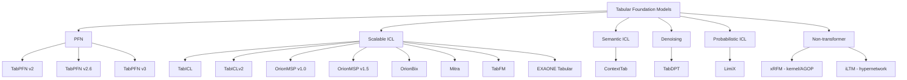

# Supported Models Overview

TabTune integrates **16 tabular foundation models across seven architectural families**
behind one scikit-learn-style API. This page compares them on the axes that actually decide
a choice: what they can do, what they refuse to do, and whether you are allowed to ship them.

!!! tip "Do not hardcode this list"
    The registry is the source of truth and is queryable at runtime:
    ```python
    from tabtune.registry import list_model_names, list_models, models_dataframe
    list_model_names()
    models_dataframe()
    ```
    See [Model Registry](../user-guide/registry.md).

---

## 1. Model ecosystem


```mermaid
flowchart TD
    A[Tabular Foundation Models] --> B[PFN]
    A --> C[Scalable ICL]
    A --> D[Semantic ICL]
    A --> E[Denoising]
    A --> F[Probabilistic ICL]
    A --> G[Non-transformer]

    B --> B1[TabPFN v2]
    B --> B2[TabPFN v2.6]
    B --> B3[TabPFN v3]

    C --> C1[TabICL]
    C --> C2[TabICLv2]
    C --> C3[OrionMSP v1.0]
    C --> C4[OrionMSP v1.5]
    C --> C5[OrionBix]
    C --> C6[Mitra]
    C --> C7[TabFM]
    C --> C8[EXAONE Tabular]

    D --> D1[ContextTab]
    E --> E1[TabDPT]
    F --> F1[LimiX]

    G --> G1[xRFM - kernel/AGOP]
    G --> G2[iLTM - hypernetwork]
```

---

## 2. Capability matrix

| Model | Family / Paradigm | Key Innovation | Supported Strategies |
|-------|------------------|----------------|----------------------|
| **TabPFN-v2** | PFN / ICL | Approximates Bayesian inference on synthetic data | Inference, Meta-Learning FT, SFT, PEFT\*, Regression, Regression FT |
| **TabPFN-v2.6** | PFN / ICL | Prior Labs release with native finetuning API | Inference, Meta-Learning FT, SFT, Native FT, PEFT\*, Regression, Regression FT |
| **TabPFN-v3** | PFN / ICL | Column embedding → row aggregation → ICL over compressed rows | Inference, Meta-Learning FT, SFT, Native FT, PEFT, Regression, Regression FT |
| **TabICL** | Scalable ICL | Two-stage column-then-row attention | Inference, Meta-Learning FT, SFT, PEFT |
| **TabICLv2** | Scalable ICL | QASSMax normalisation + native quantile regression head | Inference, FT, Regression, Regression FT |
| **OrionMSP v1.0** | Scalable ICL | Multi-Scale Sparse Attention | Inference, Meta-Learning FT, SFT, PEFT |
| **OrionMSP v1.5** | Scalable ICL | Stabilized prototype refinement | Inference, Meta-Learning FT, SFT, PEFT |
| **OrionBix** | Scalable ICL | Tabular Bi-Axial In-Context Learning | Inference, Meta-Learning FT, SFT, PEFT |
| **Mitra** | Scalable ICL | 2D attention (row & column), mixed synthetic priors | Inference, Meta-Learning FT, SFT, PEFT, Regression, Regression FT |
| **ContextTab** | Semantics-Aware ICL | Modality-specific embeddings; first-class text and datetime | Inference, Full FT, PEFT\*, Regression, Regression FT |
| **TabDPT** | Denoising Transformer | Denoising pretraining + retrieval-based context | Inference, Meta-Learning FT, SFT, Regression, Regression FT |
| **LimiX** | Probabilistic / ICL | Likelihood-based mixture modelling; uncertainty-aware | Inference, Regression, Regression FT |
| **TabFM** | Hybrid-Attention ICL (Google) | Alternating row/column attention → CLS compression → causal ICL | Inference, Meta-Learning FT, SFT, PEFT, Regression, Regression FT |
| **xRFM** | Kernel / Feature Learning | AGOP feature learning, tree-partitioned EigenPro. **No pretrained weights** | Inference, Refit, Refine, PEFT†, Regression |
| **iLTM** | Hypernetwork | Hypernetwork generates MLP ensembles from dataset embeddings | Inference, Meta-Learning FT, SFT, PEFT, Regression, Regression FT |
| **EXAONE Tabular** | Cross-Axis ICL (LG AI Research) | CAST; ~21M params, 8-member ensemble, ECOC for >10 classes | Inference, Meta-Learning FT, SFT, PEFT‡, Regression‡‡ |

\* PEFT is **experimental**; `inference` is fully supported.
† xRFM's `peft` is low-rank adaptation of the learned **M** matrix, not LoRA over linear layers.
‡ EXAONE's projections are raw `nn.Parameter` tensors applied through `F.linear`, so the LoRA injector wraps zero adapters and the run proceeds as a full fine-tune.
‡‡ EXAONE regression is implemented and tested, but LG AI Research publishes no regression checkpoint — supply a local weights file.

---

## 3. Envelopes: what each checkpoint will refuse

Envelope violations are checked **before any weights download**. Hard limits raise; soft
limits warn.

| Model | Max classes | Max features | Max rows | Native NaN / text / categorical |
|---|---:|---:|---:|---|
| TabPFN | 10 **(hard)** | 500 | 10,000 | NaN |
| TabPFNv2.6 | 10 **(hard)** | 500 | 10,000 | NaN |
| TabPFNv3 | 160 **(hard)** | 20,000 | 1,000,000 (≈200M cell budget) | NaN |
| TabICL | — | — | — | NaN |
| TabICLv2 | — | 2,000 | 500,000 | NaN |
| OrionMSP / v1.5 / OrionBix | — | — | — | NaN |
| Mitra | — | — | 10,000 | — |
| ContextTab | — | — | — | text + categorical |
| TabDPT | — | — | — | — |
| LimiX | — | — | — | NaN |
| TabFM | 10 **(hard)** | 500 | — | — |
| xRFM | — | — | — | categorical |
| iLTM | 100 **(hard)** | dimensionality-agnostic | retrieval capped at 8,192 | categorical |
| EXAONE Tabular | soft — ECOC above 10 | 100 (soft, top-100 selection) | 100,000 (soft, subsampled) | NaN |

```python
from tabtune.registry import check_envelope
check_envelope("TabFM", n_rows=1_000, n_features=20, n_classes=14)
# EnvelopeError: TabFM supports at most 10 classes (found 14)
```

!!! note "TabPFN-v3 has a *cell budget*, not a row cap"
    Roughly 1M × 200, 100k × 2,000 or 1k × 20,000. An 8-estimator ensemble needs on the
    order of 56 GB of KV cache at 1M rows.

---

## 4. Licensing: what you can actually ship

The `Commercial` column reflects the **weight** licence, which is what decides deployment.
`unverified` means TabTune has not confirmed the terms — it warns rather than blocking.

| Model | Weight licence | Commercial |
|---|---|---|
| TabICL, TabICLv2 | BSD-3-Clause | ✅ |
| OrionMSP, OrionMSPv1.5, OrionBix | MIT | ✅ |
| xRFM | MIT (no weights to license) | ✅ |
| iLTM | Apache-2.0 | ✅ (attribution) |
| Mitra | CC-BY-4.0 | ✅ (attribution) |
| TabPFN, TabPFNv2.6 | Prior Labs License | ⚠️ unverified |
| TabDPT | see upstream | ⚠️ unverified |
| TabPFNv3 | TABPFN-3.0 License v1.0 | ❌ research only |
| ContextTab | SAP-RPT-1-OSS | ❌ research only |
| LimiX | LimiX (academic use free) | ❌ without authorization |
| TabFM | TabFM Non-Commercial v1.0 | ❌ |
| EXAONE Tabular | EXAONE AI Model License 1.1 - NC | ❌ |

```python
TabularPipeline("TabPFNv3", license_mode="commercial")   # raises LicenseError
```

See [Model Registry](../user-guide/registry.md) for the full mechanics.

---

## 5. Choosing a model

### 5.1 By dataset size

| Rows | First choice | Alternatives |
|---|---|---|
| < 10K | TabPFN / TabPFNv2.6 / TabPFNv3 (inference) | Mitra, EXAONE |
| 10K – 100K | TabICLv2, TabICL | OrionMSP, iLTM, TabFM |
| 100K – 500K | TabICLv2 (KV offloading), TabDPT | OrionMSP, OrionBix |
| 500K – 2M+ | TabDPT, OrionMSP, OrionBix | TabPFNv3 (cell budget permitting) |
| ≥ 60K, kernel-friendly | **xRFM** | — |

### 5.2 By constraint

| Constraint | Pick |
|---|---|
| **Must ship commercially** | TabICLv2, OrionMSP/v1.5, OrionBix, Mitra, iLTM, xRFM |
| **Air-gapped / no downloads** | **xRFM** — trains from scratch |
| **Text-heavy features** | ContextTab |
| **> 10 classes** | TabPFNv3 (160), iLTM (100), EXAONE (ECOC) |
| **> 100 classes** | TabPFNv3 |
| **> 2,000 features** | TabPFNv3 (20,000), iLTM |
| **Native quantile regression** | TabICLv2, TabPFN family |
| **Native fine-tuning pipeline** | TabPFNv2.6, TabPFNv3 |
| **Production PEFT** | TabICL, OrionMSP, OrionBix, TabDPT, Mitra, TabFM, TabPFNv3, iLTM |

### 5.3 By task

- **Classification only**: TabICL, OrionMSP, OrionMSPv1.5, OrionBix
- **Both tasks**: TabPFN family, TabICLv2, Mitra, ContextTab, TabDPT, TabFM, xRFM, iLTM, EXAONE
- **Regression emphasis**: LimiX, TabICLv2, TabPFNv2.6/v3

```python
from tabtune.registry import list_models
[s.name for s in list_models(task="regression", commercial_ok=True)]
```

---

## 6. Feature support matrix

| Feature | TabPFN | v2.6 | v3 | TabICL | TabICLv2 | OrionMSP | OrionBix | TabDPT | Mitra | ContextTab | LimiX | TabFM | xRFM | iLTM | EXAONE |
|---|---|---|---|---|---|---|---|---|---|---|---|---|---|---|---|
| Numerical | ✅ | ✅ | ✅ | ✅ | ✅ | ✅ | ✅ | ✅ | ✅ | ✅ | ✅ | ✅ | ✅ | ✅ | ✅ |
| Categorical | ✅ | ✅ | ✅ | ✅ | ✅ | ✅ | ✅ | ✅ | ✅ | ✅ | ✅ | ✅ | ✅ | ✅ | ✅ |
| Missing values | ✅ | ✅ | ✅ | ✅ | ✅ | ✅ | ✅ | ✅ | ✅ | ✅ | ✅ | ✅ | ✅ | ✅ | ✅ |
| Text features | ❌ | ❌ | ❌ | ❌ | ❌ | ❌ | ❌ | ❌ | ❌ | ✅ | ❌ | ❌ | ❌ | ❌ | ❌ |
| Large data (>1M) | ❌ | ❌ | ✅ | ✅ | ⚠️ 500K | ✅ | ✅ | ✅ | ❌ | ❌ | ❌ | ❌ | ⚠️ | ⚠️ | ❌ |
| Small data (<10K) | ✅ | ✅ | ✅ | ✅ | ✅ | ⚠️ | ⚠️ | ⚠️ | ✅ | ✅ | ✅ | ✅ | ⚠️ | ✅ | ✅ |
| Classification | ✅ | ✅ | ✅ | ✅ | ✅ | ✅ | ✅ | ✅ | ✅ | ✅ | ✅ | ✅ | ✅ | ✅ | ✅ |
| Regression | ✅ | ✅ | ✅ | ❌ | ✅ | ❌ | ❌ | ✅ | ✅ | ✅ | ✅ | ✅ | ✅ | ✅ | ⚠️ |
| PEFT | ⚠️ | ⚠️ | ✅ | ✅ | ❌ | ✅ | ✅ | ✅ | ✅ | ⚠️ | ❌ | ✅ | † | ✅ | ‡ |
| No download needed | ❌ | ❌ | ❌ | ❌ | ❌ | ❌ | ❌ | ❌ | ❌ | ❌ | ❌ | ❌ | ✅ | ❌ | ❌ |

---

## 7. Performance characteristics

!!! note "Benchmark disclaimer"
    All figures below are **rough guidelines**, not measurements you should quote. They
    depend on hardware, dataset characteristics, hyperparameters and software versions. Run
    [`TabularLeaderboard`](../user-guide/leaderboard.md) on *your* data before choosing.

### 7.1 Memory during training (approximate, GPU)

| Model | Strategy | Memory range |
|---|---|---|
| TabPFN family | inference | 2-4 GB |
| TabICL / TabICLv2 | inference | 3-6 GB |
| TabICL / TabICLv2 | finetune | 8-16 GB |
| TabICL | peft | 4-8 GB |
| OrionMSP | finetune | 10-20 GB |
| OrionBix | finetune | 12-24 GB |
| TabDPT | finetune | 12-28 GB |
| Mitra | finetune | 16-32 GB |
| ContextTab | finetune | 8-16 GB |
| EXAONE | inference | 1-3 GB (~21M params) |
| xRFM | fit | GPU memory per tree leaf; `max_leaf_size` auto-rescales |

PEFT typically reduces memory by **40-60%** versus full fine-tuning — except on xRFM and
EXAONE, where `peft` does not mean LoRA (see the footnotes above).

### 7.2 Benchmarking methodology

1. **Same splits** across models
2. **Same preprocessing** — identical `DataProcessor` settings
3. **Multiple seeds** — average over 3-5 runs
4. **Same hardware**
5. **Fair tuning budget** per model
6. **Measure the shift gap**, not just the IID score — see
   [Shift-Aware Evaluation](../user-guide/shift-evaluation.md)

---

## 8. Per-model pages

| PFN | Scalable ICL | Other |
|---|---|---|
| [TabPFN](tabpfn.md) | [TabICL](tabicl.md) | [ContextTab](contexttab.md) |
| [TabPFN v2.6](tabpfnv26.md) | [TabICL v2](tabiclv2.md) | [TabDPT](tabdpt.md) |
| [TabPFN v3](tabpfnv3.md) | [OrionMSP](orion-msp.md) | [LimiX](limix.md) |
| | [OrionMSP v1.5](orionmsp1.5.md) | [xRFM](xrfm.md) |
| | [OrionBix](orion-bix.md) | [iLTM](iltm.md) |
| | [Mitra](mitra.md) | [EXAONE Tabular](exaone.md) |
| | [TabFM](tabfm.md) | |
