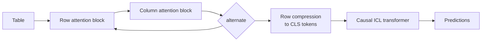

# TabFM (Google Research)

*New in TabTune 0.2.0.*

**TabFM** is Google Research's zero-shot tabular foundation model, pretrained on synthetic
structural causal models. Its distinguishing feature is a **hybrid attention** stack:
alternating row and column blocks compress each row to a CLS token, and a causal in-context
transformer then learns over those compressed rows.

Registered as `TabFM`; `Tab-FM` and `google-tabfm` also resolve.

```python
from tabtune import TabularPipeline

pipe = TabularPipeline(model_name="TabFM", task_type="classification", tuning_strategy="inference")
pipe.fit(X_train, y_train)
print(pipe.evaluate(X_test, y_test))
```

---

## 1. Installation

TabFM requires the optional upstream `tabfm` package with the PyTorch backend:

```bash
pip install "tabfm[pytorch]"
```

Pretrained weights (`google/tabfm-1.0.0-pytorch`) are auto-downloaded from the Hugging Face
Hub on first use.

---

## 2. Architecture



| Property | Value |
|---|---|
| Family | Hybrid-attention ICL |
| Weights | `google/tabfm-1.0.0-pytorch` |
| Pretraining | Synthetic structural causal models |
| Announcement | [Google Research blog](https://research.google/blog/introducing-tabfm-a-zero-shot-foundation-model-for-tabular-data/) |

---

## 3. Envelope

| Constraint | Value | Severity |
|---|---:|---|
| `max_classes` | `10` | **error** |
| `max_features` | `500` | warn |

!!! warning "The ten-class limit is architectural"
    The pretrained output head has **ten slots** and cannot be widened without retraining.
    An 11-class target is caught by the registry in microseconds, before the checkpoint
    downloads.

```python
from tabtune.registry import check_envelope
check_envelope("TabFM", n_rows=1_000, n_features=20, n_classes=14)
# EnvelopeError: TabFM supports at most 10 classes (found 14)
```

Unlike EXAONE, TabFM has **no ECOC fallback** — there is no way to run more than ten classes.

---

## 4. Model parameters

```python
model_params = {
    'n_estimators': 8,                  # ensemble size
    'softmax_temperature': 0.9,
    'ignore_pretraining_limits': True,
    'device': 'cuda',
    'dtype': None,
    'checkpoint_path': None,
    'random_state': 42,
}
```

| Parameter | Type | Default | Description |
|---|---|---|---|
| `n_estimators` | int | vendored default | Ensemble members; higher = steadier, slower |
| `softmax_temperature` | float | vendored default | Lower = sharper predictions |
| `ignore_pretraining_limits` | bool | `True` | Permit inputs above the pretraining size limits |
| `device` | str | auto | `'cuda'` or `'cpu'` |
| `dtype` | torch dtype | `None` | Override the checkpoint dtype |
| `checkpoint_path` | str | `None` | Local weights file |
| `random_state` | int | `42` | Seed |

Unknown keys are logged at debug level rather than forwarded blindly.

---

## 5. Supported strategies

TabFM has the **full** TabTune surface, including production-grade PEFT.

| Task | Strategy | Modes |
|---|---|---|
| Classification | `inference` | — |
| Classification | `finetune` | `meta-learning`, `sft`, `turn_by_turn` |
| Classification | `peft` | ✅ full LoRA support |
| Regression | `inference`, `finetune` | `turn_by_turn` (default), `meta-learning`, `sft` |

### 5.1 PEFT (LoRA on the attention + ICL blocks)

```python
pipe = TabularPipeline(
    model_name="TabFM",
    task_type="classification",
    tuning_strategy="peft",
    tuning_params={
        "epochs": 5,
        "learning_rate": 2e-6,
        "finetune_mode": "meta-learning",   # or "sft"
        "peft_config": {"r": 8, "lora_alpha": 16, "lora_dropout": 0.05},
    },
)
pipe.fit(X_train, y_train)
```

!!! tip "TabFM likes small learning rates"
    `2e-6` is a reasonable starting point for PEFT — an order of magnitude below the `1e-5`
    that suits the ICL family.

### 5.2 Regression

```python
reg = TabularPipeline(model_name="TabFM", task_type="regression", tuning_strategy="inference")
reg.fit(X_train, y_train)
print(reg.evaluate(X_test, y_test))
```

Episodic turn-by-turn fine-tuning is supported for regression as well.

---

## 6. Licensing

!!! danger "Code is Apache-2.0; the released weights are not"
    The **TabFM Non-Commercial License v1.0** governs the weights. `LicenseSpec` describes
    the weights, so `commercial_use_ok=False`.

```python
from tabtune.registry import check_license
check_license("TabFM", "commercial")   # raises LicenseError
```

Commercial alternatives: Mitra, TabICLv2, OrionMSP, OrionMSPv1.5, OrionBix.

---

## 7. When to use TabFM

**Good fit**

- Research and internal evaluation on tables with **≤10 classes and ≤500 features**
- Zero-shot baselines — it is trained for exactly that
- PEFT experiments: it is one of the models with full, non-experimental LoRA support
- Regression alongside classification through one API

**Poor fit**

- More than ten classes (hard limit, no fallback)
- Commercial deployment (licence)
- Very wide tables beyond 500 features

---

## See Also

- [Model Overview](overview.md)
- [PEFT & LoRA](../advanced/peft-lora.md)
- Runnable example: `examples/13_tabfm_classification_regression.py`
