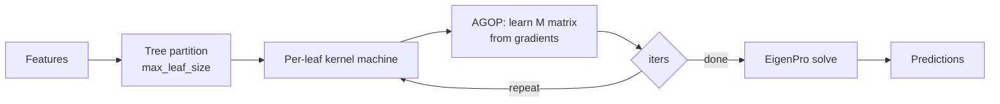

# xRFM: Recursive Feature Machine

*New in TabTune 0.2.0.*

**xRFM** is the odd one out among TabTune's models: it is not a transformer, it has **no
pretrained weights**, and it trains from scratch on every dataset. It is a *kernel method*
that learns features via the **Average Gradient Outer Product (AGOP)**, partitions the input
space with a tree, and solves each leaf with EigenPro so it scales to large tabular data.

Registered as `XRFM`; `xRFM`, `x-RFM`, `RFM` and `RecursiveFeatureMachine` all resolve to it.

```python
from tabtune import TabularPipeline

pipeline = TabularPipeline(
    model_name="xRFM",
    task_type="classification",
    tuning_strategy="inference",
)
pipeline.fit(X_train, y_train)
print(pipeline.evaluate(X_test, y_test))
```

!!! success "The only bundled model that works air-gapped out of the box"
    There are no weights to download and nothing to pre-stage. If your environment has no
    network access, xRFM runs anyway.

---

## 1. How it works



The **M matrix** is the learned feature metric: each AGOP iteration reweights the kernel by
the average outer product of the model's gradients, so the kernel gradually concentrates on
the directions that matter.

| Property | Value |
|---|---|
| Family | Kernel / feature learning |
| Pretrained weights | **none** — trains from scratch |
| Native categorical handling | Yes |
| Licence | MIT (Copyright © 2025 Daniel Beaglehole) |
| Paper | <https://arxiv.org/abs/2508.10053> |
| Source | <https://github.com/dmbeaglehole/xRFM> |

---

## 2. Envelope

There is **no hard row or feature cap**. The practical ceiling is GPU memory per tree leaf.

!!! warning "Results can differ across hardware"
    `max_leaf_size` (default `60,000`) is auto-rescaled from the device's memory, so the
    same script on a different GPU may produce a different partition — and therefore
    slightly different numbers. Pin it explicitly if you need reproducibility across
    machines.

Upstream reports xRFM becomes competitive from roughly **60k rows** upward.

---

## 3. Model parameters

```python
model_params = {
    'kernel': 'l2',                  # kernel family
    'bandwidth': 10.0,
    'exponent': 1.0,
    'diag': False,                   # diagonal M matrix (cheaper, less expressive)
    'bandwidth_mode': 'constant',
    'reg': 1e-3,                     # ridge regularization
    'iters': 4,                      # AGOP iterations
    'n_trees': 1,
    'tuning_metric': 'brier',
    'categorical_encoding': 'onehot',
    'val_size': 0.2,
    'device': 'cuda',
    'random_state': 42,
    'verbose': False,
    'rfm_params': None,              # raw dict passed to the vendored estimator
}
```

| Parameter | Type | Default | Description |
|---|---|---|---|
| `kernel` | str | `'l2'` | Kernel family used per leaf |
| `bandwidth` | float | `10.0` | Kernel bandwidth |
| `exponent` | float | `1.0` | Kernel exponent |
| `diag` | bool | `False` | Restrict **M** to its diagonal — much cheaper on wide data |
| `bandwidth_mode` | str | `'constant'` | Fixed or adaptive bandwidth |
| `reg` | float | `1e-3` | Ridge term in the EigenPro solve |
| `iters` | int | `4` | AGOP iterations; more = more feature learning, more time |
| `n_trees` | int | `1` | Trees in the partition ensemble |
| `tuning_metric` | str | `'brier'` | Metric used for internal model selection |
| `categorical_encoding` | str | `'onehot'` | Categorical handling |
| `val_size` | float | `0.2` | Internal validation fraction |
| `device` | str | auto | `'cuda'` or `'cpu'` |
| `random_state` | int | `42` | Seed |
| `rfm_params` | dict | `None` | Escape hatch to the vendored estimator (e.g. `max_leaf_size`) |

### Tuning guidance

- **`iters`**: `2-4` is usually enough. Past `~6` the M matrix stops moving and you are just
  paying for solves.
- **`diag=True`**: try it first on wide tables — a full M matrix is `d x d`.
- **`bandwidth`**: the single most impactful knob. Sweep it before anything else.
- **`n_trees > 1`**: helps on heterogeneous data at linear cost.

---

## 4. Strategies: `refit` and `refine`, not gradient descent

xRFM has **no gradient-descent fine-tuning**, so its `finetune_modes` are different from
every other model:

| Mode | Meaning |
|---|---|
| `refit` | Fit the RFM from scratch on the new data |
| `refine` | Warm-start from the previously learned **M** matrix and continue |

```python
pipeline = TabularPipeline(
    model_name="xRFM",
    task_type="classification",
    tuning_strategy="finetune",
    finetune_mode="refine",      # or 'refit'
)
```

!!! danger "`peft` on xRFM is not LoRA"
    xRFM's `peft` performs **low-rank adaptation of the learned M matrix**, not LoRA over
    linear layers. There is no LoRA target table, and `peft_config['target_modules']` does
    not apply.

Regression is supported through `inference` and `finetune`.

---

## 5. When to use xRFM

**Good fit**

- **Air-gapped or offline environments** — nothing to download
- **Licence-constrained deployments** — MIT, and there are no weights to license
- Datasets from ~60k rows upward, where upstream reports it becomes competitive
- A genuinely different inductive bias to ensemble against transformer TFMs

**Poor fit**

- Very small datasets where an ICL model's synthetic prior is worth more than learned features
- Text-heavy tables (use ContextTab)
- Cases where you need reproducibility across heterogeneous hardware without pinning
  `max_leaf_size`

---

## 6. Ensembling with a transformer

xRFM's errors are structurally different from an ICL model's, which is exactly what a
stacking ensemble wants:

```python
from tabtune.ensemble import TabularEnsemble

ensemble = TabularEnsemble(
    models=[
        {"model_name": "xRFM",     "tuning_strategy": "inference"},
        {"model_name": "TabICLv2", "tuning_strategy": "inference"},
        {"model_name": "OrionMSP", "tuning_strategy": "inference"},
    ],
    ensemble_strategy="greedy_selection",
    task_type="classification",
)
ensemble.fit(X_train, y_train)
```

---

## See Also

- [iLTM](iltm.md) — the other non-transformer model added in 0.2.0
- [Model Overview](overview.md)
- [Ensembling Strategies](../user-guide/ensembling.md)
