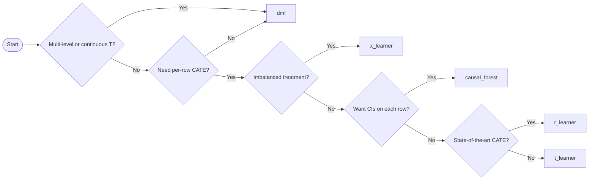

# TabTune Causal Module

## 1. Overview

The TabTune Causal module provides a unified, production-ready API for **causal inference with tabular foundation models (TFMs)**. Instead of asking *"what will happen?"* (prediction), it answers *"what happens if we intervene?"* (causation) — estimating the effect of a treatment on an outcome while adjusting for confounders.

The module wraps any TabTune TFM as a nuisance learner inside best-in-class causal estimators (DoubleML, EconML, DoWhy), so the same models you use for prediction become the engine for **double machine learning, meta-learners, and causal forests**. It follows the disciplined three-step causal workflow — **Identify → Estimate → Refute** — and adds first-class **sensitive-attribute audits** for fairness-critical deployments.

The module integrates seamlessly with TabTune's `TabularPipeline` and follows TabTune's conventions for configuration, fitting, evaluation, and rich logging.

### Key Features

- **Six estimators** spanning the full spectrum: Double ML (default), S/T/X/R-Learners, and honest Causal Forests.
- **Unified API** — the `CausalAnalysis` class handles every estimator with a consistent, `TabularPipeline`-style interface.
- **Any TFM as a nuisance learner** — TabPFN, TabPFNv26, TabICLv2, Mitra, OrionMSP, TabDPT, and more drop straight in.
- **The full causal discipline** — formal identification, effect estimation with confidence intervals, and a battery of refutation checks built in.
- **Fairness audits** — proxy detection and counterfactual-fairness checks run alongside refutation, producing a compliance-ready HTML report.
- **Heterogeneous effects** — per-row CATE estimation and single-row counterfactual prediction.
- **Multi-model ranking** — `CausalLeaderboard` ranks `(estimator × TFM)` combinations by stability and refuter pass-rate.
- **Production-grade** — comprehensive input validation, graceful degradation when optional backends are missing, verbose logging, and serialisable reports.

---

<!-- ## 2. Installation & Setup

The causal module lives under `tabtune/causal/` and is imported as:

```python
from tabtune.causal import CausalAnalysis, CausalLeaderboard
```

### Dependencies

| Package | Required | Notes |
|---------|----------|-------|
| `numpy` | Yes | Core array operations |
| `pandas` | Yes | DataFrame handling |
| `scikit-learn` | Yes | Adapter base, metrics, clone machinery |
| `scipy` | Yes | Proxy-audit statistics, meta-learner CIs |
| `networkx` | Yes | Causal-graph representation |
| `doubleml` | Yes | Default DML estimator (`DoubleMLPLR` / `DoubleMLAPOS`) |
| `econml` | Yes | Meta-learners and Causal Forest |
| `jinja2` | Optional | Templated HTML report (pure-Python fallback if absent) |
| `dowhy` | Optional | Formal identification + mediation (d-separation fallback if absent) |
| `causal-learn` | Optional | PC-algorithm graph inference (`infer_graph=True`) |
| `tabtune` | Yes (for integration) | Adapter/graph/audit unit tests run without it |

```bash
# Core causal dependencies
pip install doubleml econml networkx jinja2

# Optional: formal identification + graph inference
pip install dowhy causal-learn
```

> **Compatibility note.** Some older `econml` releases pin `scikit-learn<1.6`. If you hit a resolver conflict against TabTune's `scikit-learn>=1.6`, pin `econml==0.15.1` (sklearn-1.6-compatible) or relax sklearn to `>=1.5,<1.7`. -->

### File Structure

```
tabtune/causal/
├── __init__.py              # Public API exports
├── analysis.py              # CausalAnalysis orchestrator (user-facing)
├── leaderboard.py           # CausalLeaderboard multi-model ranking
├── adapters.py              # _TabTuneSklearnAdapter (TFM → sklearn)
├── graph.py                 # GraphBuilder + Identifier (Step 1)
├── estimators/              # Step 2
│   ├── base.py              # BaseCausalEstimator
│   ├── dml.py               # DMLEstimator (default)
│   ├── meta_learners.py     # S/T/X/R-Learners
│   └── causal_forest.py     # CausalForestEstimator
├── refute.py                # Refuter (Step 3)
├── audit/                   # Sensitive-attribute audits
│   ├── proxy.py             # ProxyAuditor
│   └── counterfactual.py    # CounterfactualFairness
└── reporter.py              # HTML / rich-print artifact writer
tests/
└── test_causal.py           # Unit + integration tests
```

---

## 2. Quick Start

### Estimating a Treatment Effect with Double ML (Recommended Default)

```python
from tabtune.causal import CausalAnalysis
from sklearn.model_selection import train_test_split

# X must contain the treatment column and every confounder.
X_train, X_test, y_train, y_test = train_test_split(X, y, test_size=0.2)

ca = CausalAnalysis(
    model_name="TabPFNv26",          # TFM used as the nuisance learner
    task_type="regression",          # task type of the OUTCOME
    treatment="treated",             # treatment column T
    outcome="outcome",               # outcome column Y (= the y you pass to fit)
    confounders=["age", "income", "score"],
    estimator="dml",                 # Double Machine Learning
    estimator_params={"n_folds": 5, "confidence_level": 0.95},
    tuning_params={"device": "cuda"},
    verbose=True,
)

ca.fit(X_train, y_train)
result = ca.evaluate(X_test, y_test, include=("effect", "refutation"))

print(result["effect"])        # ATE, std error, confidence interval
print(result["refutation"])    # placebo / RCC / subset / sensitivity checks
```

### Heterogeneous Effects with a Causal Forest

```python
ca = CausalAnalysis(
    model_name="TabPFNv26",
    task_type="regression",
    treatment="treated",
    outcome="outcome",
    confounders=["age", "income", "score"],
    estimator="causal_forest",
    estimator_params={"n_estimators": 200},
    tuning_params={"device": "cuda"},
)
ca.fit(X_train, y_train)

cate = ca.predict_cate(X_test)               # per-row treatment effect
print("Mean CATE:", cate.mean())
```

### Fairness Audit + HTML Report

```python
ca = CausalAnalysis(
    model_name="TabICLv2",
    task_type="classification",
    treatment="loan_approved",
    outcome="default_12m",
    confounders=["age", "income", "credit_score"],
    sensitive=["gender", "ethnicity"],       # enables the audits
    estimator="dml",
)
ca.fit(X_train, y_train)

ca.evaluate(
    X_test, y_test,
    include=("effect", "identification", "refutation",
             "proxy", "counterfactual_fairness"),
    output_format="rich",
    output_path="credit_causal_audit.html",  # writes a model card
)
```

---

## 3. Architecture

```
CausalAnalysis (orchestrator)
│
├── fit(X, y)
│   ├── Step 1 — Identify
│   │   ├── GraphBuilder  → DAG (user-supplied / inferred / default)
│   │   └── Identifier    → estimand + adjustment set (DoWhy or fallback)
│   │
│   └── Step 2 — Estimate
│       ├── Build outcome + treatment nuisance learners (TFM → sklearn adapter)
│       ├── Instantiate estimator via ESTIMATOR_REGISTRY[estimator]
│       └── Cross-fit the estimator on the data
│
├── evaluate(X_test, y_test, include=(...))
│   ├── effect                 → ATE / CI / per-level contrasts
│   ├── identification          → estimand report
│   ├── refutation (Step 3)     → Refuter battery
│   ├── proxy                   → ProxyAuditor
│   └── counterfactual_fairness → CounterfactualFairness
│   └── Reporter → rich log + optional HTML model card
│
├── predict_cate(X_query)          → per-row CATE
├── predict_counterfactual(row, …) → single-row what-if
└── evaluate_* (refutation / proxy / counterfactual_fairness / identification)
```

Every estimator follows the same internal contract:
- `fit(df)` — fit nuisance learners and compute the causal estimate.
- `ate(confidence_level)` — return ATE, standard error, and confidence interval.
- `cate(X_query)` — per-row treatment effects (X/R-Learner, Causal Forest).
- `counterfactual(row, intervention)` — single-row counterfactual prediction.

### The TFM → sklearn Bridge

Causal libraries expect scikit-learn-style estimators with `.fit / .predict / .predict_proba`. The `_TabTuneSklearnAdapter` wraps any `TabularPipeline` into that interface and is **clone-safe** — `sklearn.clone()` round-trips it correctly, which is mandatory because DoubleML and EconML clone nuisance learners internally during cross-fitting. The adapter reports the correct `_estimator_type` and `__sklearn_tags__()` so downstream libraries call `predict_proba` for the treatment model and `predict` for the outcome model.

---

## 4. The Causal Discipline

A predictive model answers *"given these features, what is Y?"*. A causal model answers *"if we **set** T to this value, how does Y change?"* — a fundamentally harder question that requires assumptions data alone cannot verify. The module enforces the standard three-step discipline that keeps those assumptions explicit.

### Step 1 — Identify

Before estimating anything, the module asks whether the effect is even *identifiable* from the observed data. `GraphBuilder` constructs a causal DAG (supplied by you, inferred via the PC algorithm, or the canonical "confounders cause T and Y; T causes Y" default). `Identifier` then derives the estimand — typically a **backdoor adjustment** set — using DoWhy when installed, or a d-separation fallback otherwise.

If the effect is not identifiable, the module warns loudly and you should treat downstream numbers with caution.

### Step 2 — Estimate

The chosen estimator fits two nuisance models — one for the outcome `E[Y | X]` and one for the treatment propensity `E[T | X]` — using your TFM, then combines them into a debiased estimate of the **Average Treatment Effect (ATE)** with a confidence interval. For multi-level treatments, per-level contrasts are reported.

### Step 3 — Refute

A point estimate is meaningless without stress tests. The `Refuter` perturbs the problem and checks the estimate behaves sensibly — a placebo treatment should yield ≈ 0, an injected noise confounder should barely move the estimate, and so on. Refuters that pass don't *prove* correctness, but refuters that fail prove something is wrong.

---

## 5. Estimator Reference

All estimators are selected via the `estimator="..."` argument of `CausalAnalysis` and registered in `ESTIMATOR_REGISTRY`.

### 5.1 Double Machine Learning (Default)

**Class:** `DMLEstimator`
**Estimator key:** `"dml"`

The default and most robust estimator. Fits an outcome model `g(X) = E[Y|X]` and a treatment model `m(X) = E[T|X]`, residualises both, and regresses the residuals to recover a Neyman-orthogonal ATE. Cross-fitting removes overfitting bias.

- **Binary / continuous treatment** → `doubleml.DoubleMLPLR` (partially linear regression).
- **Multi-level discrete treatment** → `doubleml.DoubleMLAPOS` (Average Potential Outcomes), reporting one contrast per treatment level.

#### Parameters (`estimator_params`)

| Parameter | Type | Default | Description |
|-----------|------|---------|-------------|
| `n_folds` | int | `5` | Cross-fitting folds |
| `n_rep` | int | `1` | Repeated cross-fitting rounds |
| `confidence_level` | float | `0.95` | CI level |
| `score` | str | `"partialling out"` | PLR score (binary/continuous T) |
| `reference_level` | numeric | smallest level | Reference for multi-level contrasts |

#### Returns (from `ate()`)

`ate`, `std_error`, `ci_lower`, `ci_upper`, `p_value`, `confidence_level`, `n_samples`, plus `per_level` and `treatment_levels` for multi-level treatments.

#### When To Use

The reliable default. Strongest theoretical guarantees, works for binary, continuous, and multi-level treatments, and is what you should reach for unless you specifically need per-row heterogeneous effects.

---

### 5.2 S-Learner

**Class:** `SLearner`
**Estimator key:** `"s_learner"`

A **single** model trained on `[X, T]` with treatment as an extra feature. CATE is the difference between predictions at `T=1` and `T=0`. Simplest meta-learner; can underestimate effects when the treatment signal is weak relative to outcome variance.

> Meta-learners (S/T/X/R) currently require a **binary `{0, 1}` treatment**. For multi-level treatments use `"dml"` or `"causal_forest"`.

#### When To Use

Quick baseline, or when the treatment effect is large and the dataset is small.

---

### 5.3 T-Learner

**Class:** `TLearner`
**Estimator key:** `"t_learner"`

**Two** models, one per treatment arm. CATE is the difference between the two arms' predictions. Robust when both arms have ample data; degrades on heavily imbalanced treatments.

#### When To Use

Balanced treatment assignment with enough data in each arm.

---

### 5.4 X-Learner

**Class:** `XLearner`
**Estimator key:** `"x_learner"`

Propensity-weighted combination of T-Learner residuals, designed specifically for **imbalanced treatments**. Imputes treatment effects on each arm, then blends them using the propensity score.

#### When To Use

When one treatment arm is much smaller than the other.

---

### 5.5 R-Learner

**Class:** `RLearner`
**Estimator key:** `"r_learner"`

Residualises both T and Y against X (DML-style), then fits a single CATE model on the residuals via `econml.dml.NonParamDML`. Strong empirical performance on heterogeneous-effect benchmarks.

#### Parameters (`estimator_params`)

| Parameter | Type | Default | Description |
|-----------|------|---------|-------------|
| `n_folds` | int | `5` | Cross-fitting folds |
| `final_model` | estimator | `GradientBoostingRegressor` | Final CATE regressor on residuals |

#### When To Use

When you want a state-of-the-art CATE estimator and have a moderately sized dataset.

---

### 5.6 Causal Forest

**Class:** `CausalForestEstimator`
**Estimator key:** `"causal_forest"`

An ensemble of honest causal trees (`econml.grf.CausalForest`) where splits maximise treatment-effect heterogeneity. *Honesty* (separate samples for splitting and estimation) yields asymptotically unbiased CATE with valid confidence intervals.

#### Parameters (`estimator_params`)

| Parameter | Type | Default | Description |
|-----------|------|---------|-------------|
| `n_estimators` | int | `200` | Number of trees (must be divisible by EconML's `subforest_size=4`) |
| `max_depth` | int | `None` | Max tree depth |
| `min_samples_leaf` | int | `5` | Minimum leaf size |
| `honest` | bool | `True` | Honest splitting |
| `random_state` | int | `0` | Seed |

#### Returns

`cate(X_query, return_ci=True)` returns a dict with `point`, `ci_lower`, and `ci_upper` arrays.

#### When To Use

Non-parametric heterogeneous effects, especially when you want per-row confidence intervals and don't want to assume a functional form.

---

## 6. Refutation Reference

Run via `evaluate(include=("refutation", ...))` or `evaluate_refutation()`. The default battery runs four checks; each returns a `pass` flag and the rule it was judged against.

| Check | Key | What it does | Pass rule |
|-------|-----|--------------|-----------|
| **Placebo treatment** | `placebo` | Shuffles T so it carries no signal; re-fits | `\|placebo_ate\| < 0.5 × \|ate\|` |
| **Random common cause** | `random_common_cause` | Injects a synthetic noise confounder; re-fits | relative ATE shift `< 0.2` |
| **Data subset** | `subset` | Re-fits on random subsamples; checks stability | coefficient-of-variation `< 0.25` |
| **Sensitivity** | `sensitivity` | E-value (VanderWeele & Ding) + Manski bounds | E-value `≥ 1.25` |

The placebo and random-common-cause checks each trigger one estimator refit; the subset check triggers `n_subset_iters` refits (default **2**); the sensitivity check is analytical and triggers **zero** refits.

> **Cost note.** Each refit re-runs the full cross-fitted estimator, which fits nuisance TFMs `n_folds × 2` times (× number of treatment levels for multi-level DML). On a 5-level treatment with `n_folds=5`, the default battery is roughly 200 TFM fits. Reduce `n_folds` or pass a smaller `checks` tuple to speed it up.

#### Refuter `run()` Parameters

| Parameter | Type | Default | Description |
|-----------|------|---------|-------------|
| `checks` | tuple | `("placebo", "random_common_cause", "subset", "sensitivity")` | Which checks to run |
| `subset_fraction` | float | `0.7` | Fraction sampled per subset refit |
| `n_subset_iters` | int | `2` | Number of subset refits |
| `seed` | int | `0` | RNG seed |

---

## 7. Sensitive-Attribute Audits

Supply `sensitive=[...]` at construction to enable two fairness audits that run alongside refutation.

### 7.1 Proxy Auditor

**Class:** `ProxyAuditor`

Detects confounders that act as **proxies** for a sensitive attribute — features that leak protected information even when the sensitive attribute itself is excluded. Each confounder is scored against each sensitive attribute (Spearman for numeric–numeric, eta² for numeric–categorical, Cramér's V for categorical–categorical), and features above `threshold` (default `0.5`) are flagged.

```python
report = ca.evaluate_proxy()
# report["per_attribute"]["gender"]["flagged"] → [{"feature": "zip_code", "score": 0.71}, ...]
```

### 7.2 Counterfactual Fairness

**Class:** `CounterfactualFairness`

For each row, flips every sensitive attribute to its other observed values (holding everything else fixed) and re-predicts. Reports the **flip rate** (fraction of rows whose prediction changes) and **mean delta** (average prediction change). A counterfactually-fair model has a flip rate near zero.

```python
report = ca.evaluate_counterfactual_fairness()
# report["per_attribute"]["gender"] → {"flip_rate": 0.03, "mean_delta": 0.004, ...}
```

Both audits feed the HTML report when `output_path` is supplied to `evaluate()`.

---

## 8. CausalAnalysis API Reference

### Constructor

```python
CausalAnalysis(
    model_name: str,                  # TFM for the nuisance learner(s)
    task_type: str,                   # "classification" | "regression" (outcome)
    treatment: str,                   # treatment column T
    outcome: str,                     # outcome column Y
    confounders: list[str],           # confounder columns X
    tuning_strategy: str = "inference",
    sensitive: list[str] = None,      # enables fairness audits
    estimator: str = "dml",           # ESTIMATOR_REGISTRY key
    treatment_model: dict = None,     # override the treatment nuisance learner
    estimator_params: dict = None,    # estimator-specific knobs
    tuning_params: dict = None,       # forwarded to TabularPipeline (e.g. device)
    processor_params: dict = None,
    model_params: dict = None,
    graph=None,                       # optional networkx.DiGraph
    infer_graph: bool = False,        # PC-algorithm graph discovery
    verbose: bool = True,
)
```

### Treatment Model Override

`treatment_model` accepts a sub-dict mirroring `TabularPipeline`, letting the treatment propensity model differ from the outcome model:

```python
treatment_model={"model_name": "TabICLv2", "tuning_strategy": "inference"}
```

When omitted, the treatment model uses the same TFM as the outcome model.

### Methods

| Method | Returns | Description |
|--------|---------|-------------|
| `fit(X, y)` | `self` | Identify, then fit nuisance learners + estimator |
| `evaluate(X_test=None, y_test=None, include=("effect",), output_format="rich", output_path=None)` | `dict` | Compose the requested report blocks |
| `evaluate_identification(output_format="rich")` | `dict` | Step-1 identification result |
| `evaluate_refutation(output_format="rich")` | `dict` | Refuter battery only |
| `evaluate_proxy(output_format="rich")` | `dict` | Proxy audit only (needs `sensitive`) |
| `evaluate_counterfactual_fairness(output_format="rich")` | `dict` | Counterfactual-fairness audit only (needs `sensitive`) |
| `predict_cate(X_query, return_ci=False)` | `ndarray` or `dict` | Per-row conditional treatment effects |
| `predict_counterfactual(row, intervention)` | `dict` | Single-row counterfactual prediction |
| `get_params(deep=True)` | `dict` | sklearn-style parameter dict |

### `include` Options for `evaluate()`

`"effect"` (always included), `"identification"`, `"refutation"`, `"proxy"`, `"counterfactual_fairness"`. The audits are silently skipped if `sensitive` was not provided.

### Output Formats

- `"rich"` — pretty-prints through the TabTune logger **and** returns the dict.
- `"json"` — prints a JSON dump and returns the dict.
- `"silent"` — returns the dict with no side effects.

---

## 9. CausalLeaderboard API Reference

Rank multiple `(estimator × TFM)` configurations on the same data.

```python
from tabtune.causal import CausalLeaderboard

lb = CausalLeaderboard(
    treatment="treated",
    outcome="outcome",
    confounders=["age", "income", "score"],
    sensitive=["gender"],
    tuning_params={"device": "cuda"},
)

lb.add_model("TabPFNv26", task_type="regression", estimator="dml")
lb.add_model("TabICLv2",  task_type="regression", estimator="dml")
lb.add_model("TabPFNv26", task_type="regression", estimator="causal_forest",
             estimator_params={"n_estimators": 200})

ranked = lb.run(X_train, y_train, rank_by="refuter_pass_rate")
print(ranked)   # DataFrame: label, model_name, estimator, ate, ci_*, refuter_pass_rate, ...
```

### Methods

| Method | Returns | Description |
|--------|---------|-------------|
| `add_model(model_name, task_type, estimator="dml", tuning_strategy="inference", treatment_model=None, estimator_params=None, label=None)` | `self` | Register one configuration (chainable) |
| `run(X, y, rank_by="refuter_pass_rate", include_refutation=True, include_proxy=False, include_counterfactual_fairness=False, verbose=True)` | `DataFrame` | Fit every entry; return a ranked table |

### `rank_by` Options

`"refuter_pass_rate"` (descending), `"ate_stability"` (ascending bootstrap-CI width), `"ci_width"` (ascending).

---

## 10. Estimator Selection Guide

| Estimator | Best For | Treatment | Heterogeneous effects |
|-----------|----------|-----------|----------------------|
| **Double ML** | General-purpose default; robust ATE | binary / continuous / multi-level | Approximate (binary) |
| **S-Learner** | Quick baseline; large effects | binary | Yes |
| **T-Learner** | Balanced arms with ample data | binary | Yes |
| **X-Learner** | Imbalanced treatment assignment | binary | Yes |
| **R-Learner** | State-of-the-art CATE | binary | Yes |
| **Causal Forest** | Non-parametric CATE with CIs | binary | Yes (with intervals) |

### Decision Flowchart



---

## 11. References

| # | Paper | Component |
|---|-------|-----------|
| 1 | Tanna, A. et al. (2025). *TabTune: A Unified Library for Inference and Fine-Tuning Tabular Foundation Models.* arXiv:2511.02802. | TabTune framework |
| 2 | Chernozhukov, V. et al. (2018). *Double/Debiased Machine Learning for Treatment and Structural Parameters.* The Econometrics Journal. | Double ML |
| 3 | Künzel, S. et al. (2019). *Metalearners for Estimating Heterogeneous Treatment Effects using Machine Learning.* PNAS. | S/T/X-Learners |
| 4 | Nie, X. & Wager, S. (2021). *Quasi-Oracle Estimation of Heterogeneous Treatment Effects.* Biometrika. | R-Learner |
| 5 | Wager, S. & Athey, S. (2018). *Estimation and Inference of Heterogeneous Treatment Effects using Random Forests.* JASA. | Causal Forest |
| 6 | Pearl, J. (2009). *Causality: Models, Reasoning, and Inference.* Cambridge University Press. | Identification |
| 7 | VanderWeele, T. & Ding, P. (2017). *Sensitivity Analysis in Observational Research: Introducing the E-Value.* Annals of Internal Medicine. | Sensitivity refuter |
| 8 | Kusner, M. et al. (2017). *Counterfactual Fairness.* NeurIPS. | Counterfactual-fairness audit |
