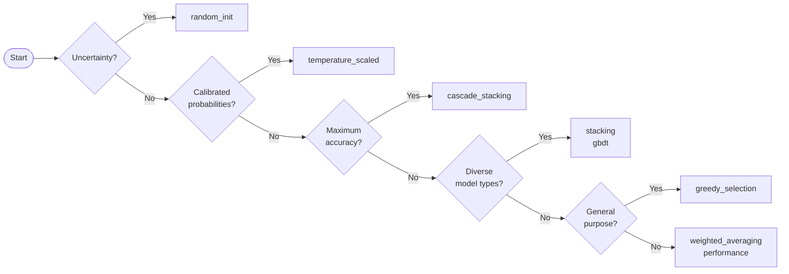

# TabTune Ensemble Module

## 1. Overview

The TabTune Ensemble module provides a unified, production-ready API for combining predictions from multiple tabular foundation models (TFMs). It implements **six ensemble strategies**, ranging from simple weighted averaging to AutoGluon-style multi-level cascade stacking and deep ensembles with epistemic uncertainty estimation.

The module is designed to integrate seamlessly with TabTune's `TabularPipeline` and follows TabTune's conventions for configuration, fitting, prediction, and evaluation.

### Key Features

- **Six strategies** covering the full spectrum from simple to state-of-the-art.
- **Unified API** — `TabularEnsemble` class handles all strategies with a consistent interface.
- **Hybrid TFM+GBDT ensembles** — optionally include XGBoost / LightGBM / sklearn GBTs as base models.
- **Epistemic uncertainty** — free uncertainty estimates from the deep ensembles strategy.
- **Production-grade** — comprehensive input validation, try/catch error handling, verbose logging, and serialisable summaries.

---

## 2. Installation & Setup

The ensemble module lives under `tabtune/ensemble/` and is imported as:

```python
from tabtune.ensemble import TabularEnsemble
```

### Dependencies

| Package | Required | Notes |
|---------|----------|-------|
| `numpy` | Yes | Core array operations |
| `pandas` | Yes | DataFrame handling |
| `scikit-learn` | Yes | Metrics, meta-learners, CV splitting |
| `scipy` | Yes | Temperature optimisation , softmax |
| `lightgbm` | Optional | GBDT meta-learner / baselines (falls back to sklearn) |
| `xgboost` | Optional | GBDT baselines |
| `tabtune` | Yes (for integration) | Strategy-only tests run without it |

### File Structure

```
tabtune/ensemble/
├── __init__.py              # Public API exports
├── strategies.py            # All 6 strategy implementations
├── tabular_ensemble.py      # TabularEnsemble orchestrator class
tests/
└── test_ensemble.py         # Unit + integration tests
```

---

## 3. Quick Start

### Classification with Greedy Selection (Recommended Default)

```python
from tabtune.ensemble import TabularEnsemble
from sklearn.model_selection import train_test_split

# Prepare data
X_train, X_test, y_train, y_test = train_test_split(X, y, test_size=0.2)

# Build ensemble
ensemble = TabularEnsemble(
    models=[
        {"model_name": "TabPFN",   "tuning_strategy": "inference"},
        {"model_name": "TabICLv2", "tuning_strategy": "inference"},
        {"model_name": "OrionMSP", "tuning_strategy": "inference"},
    ],
    ensemble_strategy="greedy_selection",
    task_type="classification",
    verbose=True,
)

# Fit & evaluate
ensemble.fit(X_train, y_train)
results = ensemble.evaluate(X_test, y_test)
print(results["ensemble"])        
print(ensemble.get_leaderboard()) 
```

### Regression with Weighted Averaging

```python
ensemble = TabularEnsemble(
    models=[
        {"model_name": "TabPFN",   "tuning_strategy": "inference"},
        {"model_name": "TabICLv2", "tuning_strategy": "inference"},
    ],
    ensemble_strategy="weighted_averaging",
    task_type="regression",
    metric="mse",
    weight_scheme="inverse_error",  
)
ensemble.fit(X_train, y_train)
predictions = ensemble.predict(X_test)
```

---

## 4. Architecture

```
TabularEnsemble (orchestrator)
│
├── fit()
│   ├── Build & fit N TabTune pipelines
│   ├── (Optional) Build & fit GBDT baselines
│   ├── Collect validation predictions
│   ├── Instantiate strategy via get_strategy()
│   └── Fit strategy on collected predictions
│
├── predict() / predict_proba()
│   ├── Collect test predictions from all pipelines
│   └── Delegate to strategy.predict() / predict_proba()
│
├── evaluate()  → Dict with ensemble + individual metrics
└── get_leaderboard() → DataFrame ranking all models
```

Internally, each strategy class follows the same interface:
- `fit(model_outputs, y_val, ...)` — learn combination weights/parameters
- `predict(model_outputs)` — return combined predictions
- `predict_proba(model_outputs)` — return combined probabilities

---

## 5. Strategy Reference

### 5.1 Weighted Averaging

**Class:** `WeightedAveraging`  
**Strategy key:** `"weighted_averaging"`

Combines model probability matrices (or point predictions for regression) via a weighted sum normalised to 1.

#### Parameters

| Parameter | Type | Default | Description |
|-----------|------|---------|-------------|
| `task_type` | str | `"classification"` | `"classification"` or `"regression"` |
| `weight_scheme` | str | `"performance"` | One of `"uniform"`, `"performance"`, `"inverse_error"` |

#### TabularEnsemble Parameters

| Parameter | Type | Default | Description |
|-----------|------|---------|-------------|
| `weight_scheme` | str | `"performance"` | Passed through to `WeightedAveraging` |
| `metric` | str | `"accuracy"` | Metric used to compute performance-based weights |

#### Weight Schemes

- **`"uniform"`** — All models get equal weight `1/K`.
- **`"performance"`** — Weight proportional to validation score. For "lower-is-better" metrics (MSE, log_loss), scores are inverted.
- **`"inverse_error"`** — Weight `= 1 / (1 - score + ε)` for "higher-is-better" metrics, concentrating mass on the very best models.

#### Manual Weights

You can also supply manual weights via the `fit()` method:

```python
from tabtune.ensemble.strategies import WeightedAveraging

wa = WeightedAveraging(task_type="classification", weight_scheme="performance")
wa.fit(
    model_outputs,
    y_val,
    weights={"TabPFN_inference": 3, "TabICLv2_inference": 1, "OrionMSP_inference": 1},
)

```

#### Formula

$$\hat{p} = \sum_{k=1}^{K} w_k \cdot p_k \quad \text{where} \quad \sum_k w_k = 1$$

The final prediction $\hat{p}$ is computed as the weighted sum of predictions $p_k$ from $K$ models, where $w_k$ is the weight assigned to the $k$-th model and all weights sum to 1.

---

### 5.2 Greedy Ensemble Selection

**Class:** `GreedyEnsembleSelection`  
**Strategy key:** `"greedy_selection"`  


Iteratively builds an ensemble by adding the model that maximises validation performance at each step. Selection is with replacement, so a model can be picked multiple times (earning proportionally higher weight). This is the same algorithm used by **AutoGluon's WeightedEnsembleModel**.

#### Parameters

| Parameter | Type | Default | Description |
|-----------|------|---------|-------------|
| `ensemble_size` | int | `50` | Number of greedy iterations |
| `task_type` | str | `"classification"` | Task type |
| `metric` | str | `"accuracy"` | Metric to optimise |
| `with_replacement` | bool | `True` | Allow repeated selection |

#### TabularEnsemble Parameters

| Parameter | Type | Default | Description |
|-----------|------|---------|-------------|
| `greedy_ensemble_size` | int | `50` | Forwarded to `ensemble_size` |
| `metric` | str | `"accuracy"` | Validation metric to maximise/minimise |

#### Algorithm

1. Start with an empty ensemble.
2. For `ensemble_size` iterations: find the model whose addition maximises the validation metric.
3. Add it (with replacement).
4. Final weight = selection count / total selections.

#### Attributes After Fit

- `weights_` — `dict[str, float]`: normalised selection-count-based weights.
- `selection_history_` — `list[tuple[str, float]]`: `(model_name, score)` per iteration.

---

### 5.3 Stacking (Meta-Learning)

**Class:** `StackingEnsemble`  
**Strategy key:** `"stacking"`  


Trains a second-level meta-learner on cross-validated out-of-fold (OOF) predictions from base models.

#### Parameters

| Parameter | Type | Default | Description |
|-----------|------|---------|-------------|
| `meta_learner` | str | `"lr"` | `"lr"` (LogisticRegression/Ridge), `"gbdt"` (LightGBM→sklearn fallback), `"mlp"` |
| `task_type` | str | `"classification"` | Task type |
| `n_folds` | int | `5` | CV folds for OOF generation (used externally) |
| `use_original_features` | bool | `False` | Append raw features to meta-feature matrix |

#### TabularEnsemble Parameters

| Parameter | Type | Default | Description |
|-----------|------|---------|-------------|
| `meta_learner` | str | `"lr"` | Forwarded to `StackingEnsemble` |
| `cv_folds` | int | `5` | K-fold splits for stacking OOF |

#### Meta-Learner Details

| `meta_learner` | Classification | Regression |
|----------------|---------------|------------|
| `"lr"` | `LogisticRegression(max_iter=1000, C=1.0)` | `Ridge(alpha=1.0)` |
| `"gbdt"` | `LGBMClassifier(n_estimators=100, max_depth=3)` | `LGBMRegressor(...)` |
| `"mlp"` | `MLPClassifier(hidden_layer_sizes=(64,32), max_iter=500)` | `MLPRegressor(...)` |


#### How OOF Prevents Leakage

The meta-learner never sees the same data the base models trained on. During K-fold CV, each fold's held-out predictions become the meta-features for those samples.

---

### 5.4 Temperature-Scaled Blending

**Class:** `TemperatureScaledBlending`  
**Strategy key:** `"temperature_scaled"`  


Calibrates each model's predictions using a single temperature parameter `T`, then combines with uniform weights. This is particularly valuable for TabTune models since different TFMs have varying calibration quality.

#### Parameters

| Parameter | Type | Default | Description |
|-----------|------|---------|-------------|
| `task_type` | str | `"classification"` | Task type |

#### How Temperature Scaling Works

For each model, learn `T` by minimising NLL on the validation set:

$$\hat{p} = \text{softmax}(\log(p) / T)$$

Here, $p$ represents the original predicted probabilities, $\log(p)$ converts them to logits, $T$ is the temperature scaling parameter, and $\hat{p}$ is the calibrated probability after applying softmax. Dividing by $T$ adjusts the confidence of predictions without changing their relative ordering.

- **T < 1** — Model was overconfident → sharpen predictions.
- **T > 1** — Model was underconfident → soften predictions.
- **T = 1** — Already well-calibrated.

#### Optimisation

Temperature is optimised  in log-space (to enforce `T > 0`), clamped to `[0.01, 20.0]`.

#### Attributes After Fit

- `temperatures_` — `dict[str, float]`: learned temperature per model.
- `weights_` — `dict[str, float]`: uniform weights `1/K`.

#### When To Use

When calibrated probabilities matter (risk-sensitive applications, expected calibration error evaluation). Pairs well with reliability diagrams and ECE analysis.

---

### 5.5 Cascade Stacking

**Class:** `CascadeStackingEnsemble`  
**Strategy key:** `"cascade_stacking"`  


Multi-level stacking with skip connections, mirroring AutoGluon's `best_quality` architecture. At each level, K-fold OOF predictions are concatenated with the original features and fed to the next level. A final Greedy Ensemble Selection (GES) layer picks the optimal combination across all level outputs.

#### Parameters

| Parameter | Type | Default | Description |
|-----------|------|---------|-------------|
| `n_levels` | int | `2` | Number of stacking levels |
| `n_folds` | int | `5` | K-fold splits per level |
| `ges_size` | int | `50` | GES iterations at final layer |
| `task_type` | str | `"classification"` | Task type |
| `random_state` | int | `42` | Seed for reproducibility |

#### TabularEnsemble Parameters

| Parameter | Type | Default | Description |
|-----------|------|---------|-------------|
| `n_cascade_levels` | int | `2` | Forwarded to `n_levels` |
| `cv_folds` | int | `5` | Forwarded to `n_folds` |
| `greedy_ensemble_size` | int | `50` | Forwarded to `ges_size` |

#### Architecture

```
Level 1:
  Input: Original features
  → K-fold OOF (n_models × n_classes columns)
  → Skip connection: [OOF | Original features]

Level 2:
  Input: [Level-1 OOF | Original features]
  → K-fold OOF (n_models × n_classes columns)
  → Skip connection: [OOF | Original features]

Final Layer:
  GES over ALL stacker outputs from all levels
  → Weighted combination
```

#### Key Design Choices

- **Skip connections** — Higher levels always see the original features, preventing information loss.
- **OrdinalEncoder for skip features** — Categorical columns are encoded to float arrays (fitted on train only) so skip-connection hstacking always succeeds.
- **GES final layer** — Instead of training yet another meta-learner, GES picks the optimal weighted mix across all stacker outputs.

#### Example

```python
ensemble = TabularEnsemble(
    models=[
        {"model_name": "TabPFN",   "tuning_strategy": "inference"},
        {"model_name": "TabICLv2", "tuning_strategy": "inference"},
        {"model_name": "OrionMSP", "tuning_strategy": "inference"},
    ],
    ensemble_strategy="cascade_stacking",
    n_cascade_levels=2,
    cv_folds=3,           
    greedy_ensemble_size=50,
    verbose=True,
)
ensemble.fit(X_train, y_train)
```

---

### 5.6 Random-Init Ensemble (Deep Ensembles)

**Class:** `RandomInitEnsemble`  
**Strategy key:** `"random_init"`  


Trains each model `M` times with different random seeds, producing diverse predictions from different local minima. Per-model predictions are averaged across seeds, then cross-model averaging uses performance-based weights.

#### Parameters

| Parameter | Type | Default | Description |
|-----------|------|---------|-------------|
| `n_seeds` | int | `5` | Number of random seeds per model |
| `base_seed` | int | `42` | Starting seed (seeds: base, base+1, ..., base+M-1) |
| `task_type` | str | `"classification"` | Task type |

#### TabularEnsemble Parameters

| Parameter | Type | Default | Description |
|-----------|------|---------|-------------|
| `n_seeds` | int | `5` | Forwarded to `RandomInitEnsemble` |
| `base_seed` | int | `42` | Forwarded |

#### Epistemic Uncertainty

The variance across ensemble members provides a free epistemic uncertainty estimate per sample:

$$\text{uncertainty}(x) = \frac{1}{M \cdot K} \sum_{m=1}^{M} \sum_{c=1}^{K} \left( p_{m,c}(x) - \bar{p}_c(x) \right)^2$$

The uncertainty for input $x$ is computed as the average squared deviation between each model’s predicted probability $p_{m,c}(x)$ (for model $m$ and class $c$) and the mean prediction $\bar{p}_c(x)$ across all $M$ models, averaged over all $K$ classes—capturing how much the models disagree.

Access via:

```python
ensemble.fit(X_train, y_train)
predictions = ensemble.predict(X_test)
uncertainty = ensemble.get_uncertainty()  
```

High uncertainty = models disagree across seeds = uncertain prediction.

#### Example

```python
ensemble = TabularEnsemble(
    models=[
        {"model_name": "TabPFN",   "tuning_strategy": "inference"},
        {"model_name": "TabICLv2", "tuning_strategy": "inference"},
    ],
    ensemble_strategy="random_init",
    n_seeds=5,            
    base_seed=42,
    verbose=True,
)
ensemble.fit(X_train, y_train)

# Access uncertainty
uncertainty = ensemble.get_uncertainty()
most_uncertain = np.argsort(uncertainty)[-10:][::-1]
print(f"Most uncertain test indices: {most_uncertain}")
```

---

## 6. TabularEnsemble API Reference

### Constructor

```python
TabularEnsemble(
    models: List[Dict],              
    ensemble_strategy: str = "greedy_selection",
    task_type: str = "classification",
    metric: str = "accuracy",
    cv_folds: int = 5,
    holdout_fraction: float = 0.2,
    meta_learner: str = "lr",
    greedy_ensemble_size: int = 50,
    include_gbdt_baselines: bool = False,
    n_cascade_levels: int = 2,
    n_seeds: int = 5,
    base_seed: int = 42,
    weight_scheme: str = "performance",
    verbose: bool = True,
)
```

### Model Configuration Dict

Each entry in `models` is a dict:

```python
{
    "model_name": "TabPFN",              # Required: TabTune model name
    "tuning_strategy": "inference",       # Optional (default: "inference")
    "tuning_params": {"device": "cuda"},  # Optional: passed to TabularPipeline
    "model_params": {},                   # Optional: model-specific params
    "finetune_mode": "meta-learning",     # Optional: for finetune strategy
}
```

### Methods

| Method | Returns | Description |
|--------|---------|-------------|
| `fit(X_train, y_train, X_val=None, y_val=None)` | `self` | Fit all base models + ensemble strategy |
| `predict(X_test)` | `ndarray (n,)` | Class labels or point estimates |
| `predict_proba(X_test)` | `ndarray (n, k)` | Probability matrix (classification only) |
| `evaluate(X_test, y_test)` | `dict` | Full evaluation with ensemble + individual metrics |
| `get_leaderboard()` | `DataFrame` | Ranked model comparison table |
| `get_uncertainty()` | `ndarray (n,)` or `None` | Epistemic uncertainty (deep ensembles only) |
| `summary()` | `dict` | JSON-serialisable ensemble summary |

---

## 7. Strategy Selection Guide

| Strategy | Best For | Speed | Complexity |
|----------|----------|-------|------------|
| **Weighted Averaging** | Quick baseline; production with low latency | Fastest | Lowest |
| **Greedy Selection** | General-purpose default (recommended) | Fast | Low |
| **Stacking** | Diverse model errors; large datasets | Medium | Medium |
| **Temperature Scaled** | Risk-sensitive; calibrated probabilities | Fast | Low |
| **Cascade Stacking** | Maximum accuracy; competition settings | Slow | High |
| **Random-Init** | Uncertainty estimation; robust predictions | Slow | Medium |

### Decision Flowchart



---

## 8. References

| # | Paper | Strategy |
|---|-------|----------|
| 1 | Tanna, A. et al. (2025). *TabTune: A Unified Library for Inference and Fine-Tuning Tabular Foundation Models.* arXiv:2511.02802. | TabTune framework |
| 2 | Caruana, R. et al. (2004). *Ensemble Selection from Libraries of Models.* ICML. | Greedy Selection |
| 3 | Wolpert, D. H. (1992). *Stacked Generalization.* Neural Networks 5, 241-259. | Stacking |
| 4 | Guo, C. et al. (2017). *On Calibration of Modern Neural Networks.* ICML. | Temperature Scaling |
| 5 | Erickson, N. et al. (2020). *AutoGluon-Tabular.* arXiv:2003.06505. | Cascade Stacking |
| 6 | Ting, K. M. & Witten, I. H. (1999). *Issues in Stacked Generalization.* JAIR. | Cascade Stacking |
| 7 | Lakshminarayanan, B. et al. (2017). *Simple and Scalable Predictive Uncertainty Estimation using Deep Ensembles.* NeurIPS. | Deep Ensembles |

---

<!-- ## Appendix: Strategy Factory

Use `get_strategy()` for direct strategy instantiation (without `TabularEnsemble`):

```python
from tabtune.ensemble.strategies import get_strategy, STRATEGY_MAP

# List all available strategies
print(list(STRATEGY_MAP.keys()))
# ['weighted_averaging', 'greedy_selection', 'stacking',
#  'temperature_scaled', 'cascade_stacking', 'random_init']

# Instantiate directly
strategy = get_strategy("greedy_selection", task_type="classification", ensemble_size=50)
strategy.fit(model_outputs_dict, y_val)
predictions = strategy.predict(model_outputs_dict)
```

This is useful when you already have pre-computed model outputs and want to experiment with different combination strategies without refitting the base models. -->
